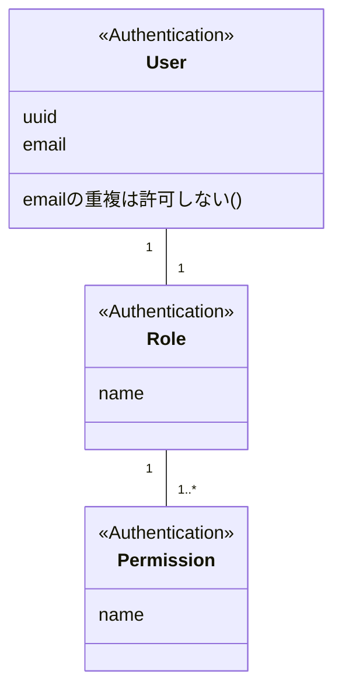

# 概要

DDD(Domain-driven design) を用いた設計・開発を行います

# ユースケース

まずは何をシシテム化するか整理するためにユースケース作成  
**主語・述語・目的語を明確にした形での表現することを徹底**

1. ユーザー管理
   1. 管理者はユーザーを作成する
   1. 管理者はユーザー一覧を取得する
1. 販売管理
   1. お客様は選択した商品を注文する
   1. お客様は注文一覧を取得する
1. 配送管理
   1. 配送部門の社員は購入された商品を配送する

# ドメインモデリング

作成したユースケースを元にドメインモデリングを行う  
本ドメインモデルが実際のコーディングでも利用されます

以下を意識してモデリングを行う

1. Bounded Context を明確にする
   1. この単位でシステム・チームが分離される
1. 代表的な属性まで書き、メソッドは書かない
   1. [Mermaid](https://mermaid-js.github.io/mermaid) がコメント書けないのでメソッド欄にしょうがなく...
1. 集約の範囲を明確にする
1. 多重度も記載

## Identity Context

## Order Context

今回は検討しない

## Delivery Context

今回は検討しない
